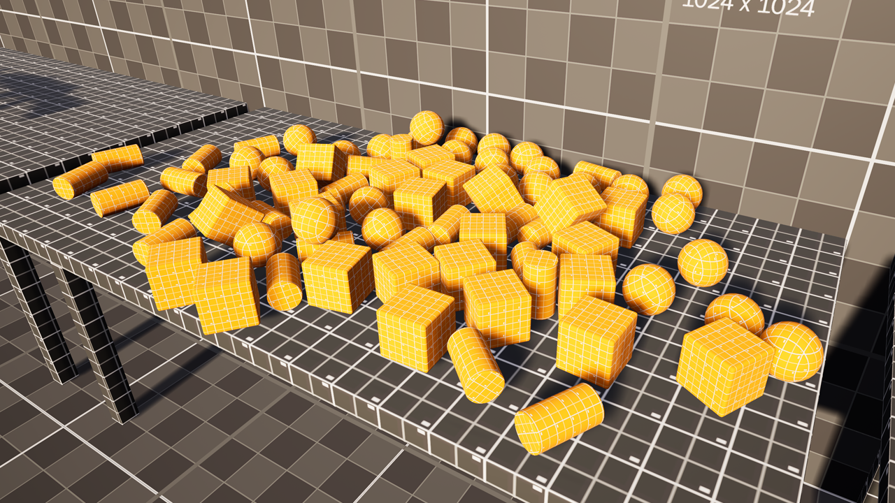

 # Enhanced Virtual Experience (EVE) Plugin Template



## Overview
The EVE Demo Template is a demonstration project showcasing the capabilities and functionalities of the EVE Plugin. Designed to accompany the EVE Plugin, this template project provides developers with a hands-on experience of integrating and utilizing the plugin's features within a VR environment. Whether you're new to VR development or an experienced developer looking to explore advanced VR interactions, this demo template serves as an invaluable resource for understanding the potential of the EVE Plugin.

Main Plugin Repository can be found [here](https://github.com/TanishSingla/Enhanced-Virtual-Experience-Plugin-EVE-)

## Getting Started
To get started with the EVE Plugin Demo Template, follow these simple steps:

1. Clone the repository to your local machine:
```bash
git clone https://github.com/Amandeep0707/VR_Template.git
```
2. Regenerate Visual Studio files.

3. Open the project in Unreal Engine.

## Documentation
For detailed documentation on using the EVE Plugin Demo Template and leveraging its features for your own projects, refer to the [EVE Plugin Documentation](https://docs.google.com/document/d/1YUKypYo-mNWKONceBwLo9VeZOQVTERbOSpwB3DJOyus/edit?usp=sharing).

## License
This project is licensed under the MIT License - see the [LICENSE](LICENSE) file for details.
